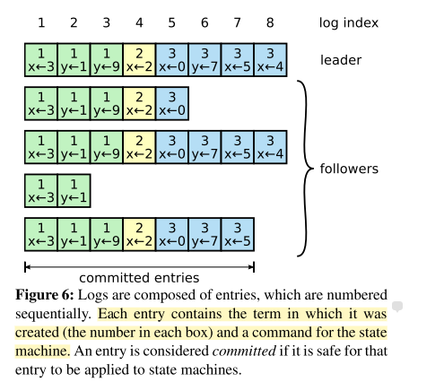

# Raft协议学习

论文地址：[https://raft.github.io/raft.pdf](https://raft.github.io/raft.pdf)

原理演示： [https://raft.github.io/raftscope/index.html](https://raft.github.io/raftscope/index.html)

## 背景

在分布式系统中，数据一致性是必须考虑的点，而且是优先考虑。在不同的场景中，数据一致性包括强一致性和弱一致性（最终一致性）。Paxos及其变种提供的共识算法扮演了重要的角色。但是非常难以理解和实现，Raft旨在简化算法逻辑，提供易于理解的共识算法。常见的 etcd 就是使用的 Raft 协议。

论文中 Raft 协议主要包括以下部分：

* leader 选举
* 日志复制
* 安全性（实际上是各种边界条件的考虑，额外增加了规则）
* 集群成员的变化

## 复制状态机

在集群中，机器都会处在相同的状态，及时部分机器失败的情况下。为了达到这个目的，一般使用日志副本的方式。保证副本日志的一致性，就是共识算法的作用。通过共识模块，不同的机器会产生相同的日志副本，副本里的命令是相同的，顺序是相同的。那么状态执行这些log，就会产生相同的状态。

## Raft 协议

通常，一个Raft集群包含5个节点，这样可以容忍2个节点的失败。

Raft使用 term （任期）的概念来代替时间的观念。term 使用正整数表示，每次leader选举，都会增加term值。

集群中三个角色：

* Follower : 是个被动角色，只会接受请求进行回应。
* Candidate: 候选人，只有 Candidate 才能发起选举投票。选举成功，变为 Leader。
* Leader: 集群中只有一个节点是这个角色。 

当系统启动，或者没有收到 leader 的心跳请求， follower 会有一个随机时间，超时后term+1,并且会变成 Candidate 会发起投票。投票成功，会变成 leader , 会立即发送心跳请求。其余失败的 Candidate 会变成 follower 。

集群中主要有两种RPC, RequestVote RPC 和 AppendEntries RPC。前者用于投票，是 Candidate 发起的。后者用于同步log数据，或者心跳请求。

一个节点收到的 term 的比自己的大，会更新当前节点的 term 。 

### leader 选举

当选举开始时，follower 增加当前的任期term, 然后变成 Candidate。它给自己投票，然后并发的把RequestVote 请求发送给其它节点。那么后面会出现三种情况：

1. 收到了大多数节点的投票，赢得选举变成 leader。 对于每个节点来说，对于同一个 term ，根据先到先得的原则只能投一次票。选举的leader 会发送心跳给其它节点，标明身份，防止新选举产生。
2. 当在等待投票的过程中，收到了其它leader的AppendEntries 请求。如果leader的term 大于等于当前节点的 term， 当前节点就会变成follower。如果小于，会拒绝请求，并且保持在 Candidate 状态。
3. 即没有赢得选举，也没有失败，没有赢取到足够的票数。那么会有超时时间。继续增加term ，并发起新一轮的选举。

Raft 使用随机的超时时间发起投票，这样保证能快速的选举出来。否则如果多个节点同时发起投票，会分散票数，那么选举会陷入循环中。

### 日志复制

当leader接受到client的请求后，会把command写入到新条目中，追加到日志。然后给其它节点发送副本，当多数节点同意接受新日志后，这个entry 进行提交并且交给状态机执行。同时成功返回给client。等下一次AppendEntries （包括心跳）发送给follower时，follower也会提交相应的日志。

每个日志条目有个index，可以理解成数组的下标。每个entry 包含term 和 command 。

当follower因为网络原因或者系统故障没有收到副本的请求，leader会一直不停地进行发送。

Raft的日志机制保证

*  不同的日志组，如果index和 term 相同，那么command必然是相同的。
* 不同的日志组，如果有相同的index和term ，那么index 之前的日志都是相等的。

leader给follower发送AppendEntries 请求时，不光包含新日志，还包含上一次的index和term， 如果上一次的index和term是相同的，那么之前所有的条目都是相同的，follower会接受这个请求，否则会拒绝请求。

当leader 和follower 都可能crash, 新选举出来的leader 不一定包括之前旧leader所有的日志。但是Raft 的日志规则是以leader日志为准，新选举的leader会把日子强制复制到follower上。为了保证日志的一致性，leader和follower要找出相同条目的最大的日志索引，follower 需要删除之后的日志，完全接受leader发送的日志。

当新leader出来后，它会把它的日志的最大index + 1 变成nextIndex 发送给 follower。发送 AppendEntries  时会包含上一次的index和term, 就是leader最新的log条目。如果 follower 和 leader 的日志是不一样的，请求会被拒绝。leader会减少nextIndex 继续发送 AppendEntries  请求。实际上就是从前往后进行倒推，直到请求被接受。那么只需要从这个nextIndex进行日志复制即可。

一条日志一个请求进行对比的话，效率并不高。可以进行 一个term 里的对比。就是说当follower 拒绝请求时，会把当前的term和当前term的第一条日志的index返回给leader, leader 可以快速的判断当前的term是否包含一致的条目。如果不包含，直接用下一个term进行判断。

### 安全性

