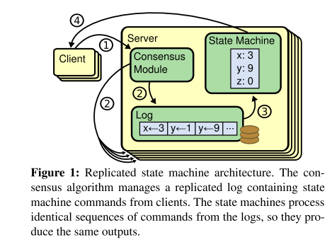

# Raft协议学习

论文地址：[https://raft.github.io/raft.pdf](https://raft.github.io/raft.pdf)

原理演示： [https://raft.github.io/raftscope/index.html](https://raft.github.io/raftscope/index.html)

## 背景

在分布式系统中，数据一致性是必须考虑的点，而且是优先考虑。在不同的场景中，数据一致性包括强一致性和弱一致性（最终一致性）。Paxos及其变种提供的共识算法扮演了重要的角色。但是非常难以理解和实现，Raft旨在简化算法逻辑，提供易于理解的共识算法。常见的 etcd 就是使用的 Raft 协议。

论文中 Raft 协议主要包括以下部分：

* leader 选举
* 日志复制
* 安全性（实际上是各种边界条件的考虑，额外增加了规则）
* 集群成员的变化

## 复制状态机

在集群中，机器都会处在相同的状态，及时部分机器失败的情况下。为了达到这个目的，一般使用日志副本的方式。保证副本日志的一致性，就是共识算法的作用。通过共识模块，不同的机器会产生相同的日志副本，副本里的命令是相同的，顺序是相同的。那么状态执行这些log，就会产生相同的状态。

## Raft 协议

通常，一个Raft集群包含5个节点，这样可以容忍2个节点的失败。

Raft使用 term （任期）的概念来代替时间的观念。term 使用正整数表示，每次leader选举，都会增加term值。

集群中三个角色：

* Follower : 是个被动角色，只会接受请求进行回应。
* Candidate: 候选人，只有 Candidate 才能发起选举投票。选举成功，变为 Leader。
* Leader: 集群中只有一个节点是这个角色。 

当系统启动，或者没有收到 leader 的心跳请求， follower 会有一个随机时间，超时后term+1,并且会变成 Candidate 会发起投票。投票成功，会变成 leader , 会立即发送心跳请求。其余失败的 Candidate 会变成 follower 。

集群中主要有两种RPC, RequestVote RPC 和 AppendEntries RPC。前者用于投票，是 Candidate 发起的。后者用于同步log数据，或者心跳请求。

一个节点收到的 term 的比自己的大，会更新当前节点的 term 。 

### leader 选举

