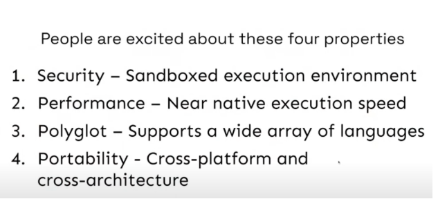
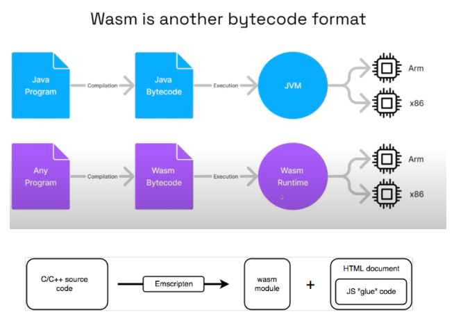
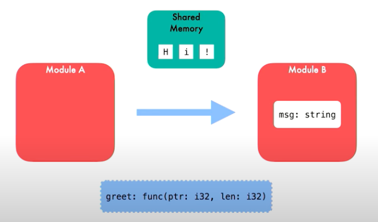
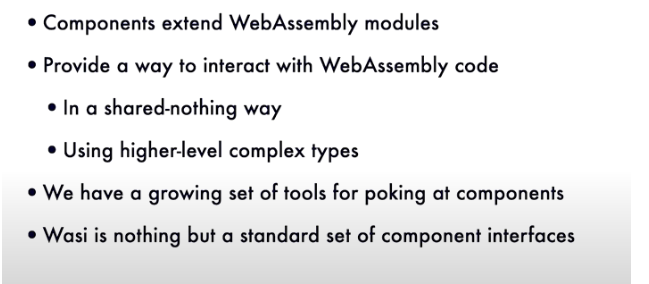

## 什么是 WebAssembly

WebAssembly（缩写为 Wasm）是一种基于堆栈的虚拟机的二进制指令格式。 Wasm 被设计为编程语言的可移植编译目标，支持在网络上部署客户端和服务器应用程序。

## 背景


目标很宏大， compile once , run anywhere。

## 特性



* 性能： 接近本机执行性能，编译成 low level 的二进制格式

* 安全： 沙箱的执行环境

* 多语言支持

* 可移植性： 跨平台,跨体系结构



有多种运行时

*  wasmtime

* wasmer

* wasmEdge

* wasmZero

两种编译技术

*  AOT

* JIT

### wasm 文本格式

参考：[https://developer.mozilla.org/en-US/docs/WebAssembly/Guides/Understanding_the_text_format](https://developer.mozilla.org/en-US/docs/WebAssembly/Guides/Understanding_the_text_format)

1. 定义个function并且导出

```code
(module
  (func $add (param $lhs i32) (param $rhs i32) (result i32)
    local.get $lhs
    local.get $rhs
    i32.add)
  (export "add" (func $add))
)
```


2. 调用其它function

```code
(module
  (func $getAnswer (result i32)
    i32.const 42)
  (func (export "getAnswerPlus1") (result i32)
    call $getAnswer
    i32.const 1
    i32.add))

```


3. 导入function

```wasm
(module
  (import "console" "log" (func $log (param i32)))
  (func (export "logIt")
    i32.const 13
    call $log))

```

4. 全局变量定义

```code
(module
  (global $g (import "js" "global") (mut i32))
  (func (export "getGlobal") (result i32)
    (global.get $g))
  (func (export "incGlobal")
    (global.set $g
      (i32.add (global.get $g) (i32.const 1))))
)

```


5. 内存使用

```code
(module
  (import "console" "log" (func $log (param i32 i32)))
  (import "js" "mem" (memory 1))
  (data (i32.const 0) "Hi")
  (func (export "writeHi")
    i32.const 0  ;; pass offset 0 to log
    i32.const 2  ;; pass length 2 to log
    call $log
  )
)

```

6. table 的用法

```code
(module
  (table 2 funcref)
  (func $f1 (result i32)
    i32.const 42)
  (func $f2 (result i32)
    i32.const 13)
  (elem (i32.const 0) $f1 $f2)
  (type $return_i32 (func (result i32)))
  (func (export "callByIndex") (param $i i32) (result i32)
    local.get $i
    call_indirect (type $return_i32))
)

```


##  wasi

网站： [https://wasi.dev/](https://wasi.dev/)

目前主要两个版本 0.1 and 0.2，（或者 wasip1, wasip2, Preview 1, Preview 2 )

通过标准化 WebAssembly API，WASI 提供了一种组合用不同语言编写的软件的方法，而无需使用昂贵且笨重的接口系统（例如基于 HTTP 的微服务）。我们相信每个具有插件模型的项目都应该使用 WASI，并且 WASI 非常适合具有多种语言 SDK（例如客户端库）的项目

安装wasmtime

```
curl https://wasmtime.dev/install.sh -sSf | bash
```

guest

* c/c++

* js

* rust

* go
* python


host

* c/c++

* rust

* go

* java

* python

## 演进

* 只支持 integers 和 floats

* 无法支持复杂类型



wasi 2.0 component model wit



##  应用场景

1. 服务器端应用:

云函数 (Serverless Functions): WASM 可以用来部署云函数，这些函数可以在无服务器架构中快速启动和执行。

微服务 (Microservices): WASM 可以用来构建轻量级的微服务，这些服务可以快速启动并具有较小的内存占用。

2. 物联网 (IoT):

边缘计算 (Edge Computing): WASM 的小体积和低资源消耗使其非常适合在物联网设备上运行。

智能设备 (Smart Devices): WASM 可以在智能音箱、摄像头和其他智能设备上运行实时分析和处理任务。

3. 数据库:

客户端数据库 (Client-side Databases): WASM 可以用来实现在客户端设备上运行的轻量级数据库，如 PostgreSQL 被编译成 WASM 在浏览器中运行的例子。

4. 网络服务:

代理和网关 (Proxies and Gateways): WASM 可以用来扩展网络服务的功能，例如通过添加过滤器、认证逻辑等。proxy-wasm 推广及应用。

5. 容器化和虚拟化:

轻量级容器 (Lightweight Containers): WASM 可以用作轻量级容器的基础，为应用程序提供隔离和资源管理。

## 语言支持

### go

#### install tinygo

```
git clone https://github.com/tinygo-org/tinygo.git

cd tinygo

git submodule update --init

make llvm-source llvm-build

make

make wasi-libc

make binaryen

```

#### guest

```go
//go:build tinygo

package main

import (
	"fmt"
	"reflect"
	"unsafe"
)

//export Add
//go:wasmexport
func Add(a, b int) int {
	return a + b
}

type User struct {
	Name string
	Age int
}

//export AddUser
func AddUser(nameData *byte, nameLen int, age int) bool {
	fmt.Println(nameLen, age)
	name := RawBytePtrToString(nameData, nameLen)

	user := User{Name: name, Age: age}
	fmt.Printf("Add User:%v\n", user)
	return true
}

func main() {
	fmt.Println("Hello, WebAssembly!")
}

func RawBytePtrToString(raw *byte, size int) string {
	//nolint
	return *(*string)(unsafe.Pointer(&reflect.SliceHeader{
		Data: uintptr(unsafe.Pointer(raw)),
		Len:  size,
		Cap:  size,
	}))
}

func RawBytePtrToByteSlice(raw *byte, size int) []byte {
	//nolint
	return *(*[]byte)(unsafe.Pointer(&reflect.SliceHeader{
		Data: uintptr(unsafe.Pointer(raw)),
		Len:  size,
		Cap:  size,
	}))
}
```


编译

```sh
tinygo build -target wasip1 -o main.wasm main.go
```

如果使用 go 编译， 参考 [这里](https://go.dev/blog/wasmexport)。

但是目前来看，还是推荐 tinygo 进行编译，生成的wasm文件更小。

查看 text format

WABT: The WebAssembly Binary Toolkit

```sh
git clone --recursive https://github.com/WebAssembly/wabt

cd wabt

git submodule update --init

mkdir build

cd build

cmake ..

cmake --build .

```

```sh
wasm2wat main.wasm
```

#### host

使用 wasmtime-go

```go
package main

import (
	"fmt"
	"log"

	"github.com/bytecodealliance/wasmtime-go/v29"
)

func main() {
	engine := wasmtime.NewEngine()
	store := wasmtime.NewStore(engine)
	// 配置 WASI 上下文
	wasiConfig := wasmtime.NewWasiConfig()
	wasiConfig.InheritStdout() // 继承标准输出
	store.SetWasi(wasiConfig)
	module, err := wasmtime.NewModuleFromFile(engine, "main.wasm")
	check(err)

	// 创建 Linker 并配置默认的 WASI 导入
	linker := wasmtime.NewLinker(engine)
	err = linker.DefineWasi()
	check(err)

	// 实例化模块
	instance, err := linker.Instantiate(store, module)
	check(err)

	addF := instance.GetExport(store, "Add").Func()
	val, err := addF.Call(store, 6, 27)
	check(err)
	fmt.Printf("add(6, 27) = %d\n", val.(int32))

	memory := instance.GetExport(store, "memory").Memory()
	fmt.Println(memory.DataSize(store), memory.Data(store))
	// 获取导出的 malloc 函数
	malloc := instance.GetExport(store, "malloc").Func()
	if malloc == nil {
		log.Fatalf("malloc function not found")
	}

	addUser := instance.GetExport(store, "AddUser").Func()
	if addUser == nil {
		log.Fatalf("AddUser function not found")
	}
	name := "Alice"
	nameData := []byte(name)
	nameLen := int32(len(name))
	// 调用 malloc 分配内存
	mallocResult, err := malloc.Call(store, nameLen+1)
	if err != nil {
		log.Fatalf("Failed to call malloc: %s", err)
	}
	namePtr := mallocResult.(int32)

	fmt.Println("namePtr", namePtr)
	fmt.Println(memory.DataSize(store), memory.Data(store))
	mem := memory.UnsafeData(store)
	fmt.Println("mem", len(mem))
	copy(mem[namePtr:], nameData)
	age := int32(30)

	// 调用 AddUser 函数
	result, err := addUser.Call(store, namePtr, nameLen, age)
	if err != nil {
		log.Fatalf("Failed to call AddUser: %s", err)
	}
	fmt.Println(result)

	// 获取导出的 free 函数并释放内存
	free := instance.GetExport(store, "free").Func()
	if free != nil {
		_, err = free.Call(store, namePtr)
		if err != nil {
			log.Fatalf("Failed to call free: %s", err)
		}
	}
}

func check(err error) {
	if err != nil {
		panic(err)
	}
}

```


use wamer-go

install wasmer

```
git clone https://github.com/wasmerio/wasmer.git

make build-capi

make package-capi

```

```go
package main

import (
	"fmt"
	"io/ioutil"

	wasmer "github.com/wasmerio/wasmer-go/wasmer"
)

func main() {

	wasmBytes, _ := ioutil.ReadFile("c.wasm")

	engine := wasmer.NewEngine()
	store := wasmer.NewStore(engine)

	// Compiles the module
	module, _ := wasmer.NewModule(store, wasmBytes)

	wasiVersion := wasmer.GetWasiVersion(module)
	fmt.Println(wasiVersion)
	wasiEnv, err := wasmer.NewWasiStateBuilder("wasi_snapshot_preview1").
		// Choose according to your actual situation
		// Argument("--foo").
		// Environment("ABC", "DEF").
		// MapDirectory("./", ".").
		Finalize()
	fmt.Println(wasiEnv, err)
	importObject, err := wasiEnv.GenerateImportObject(store, module)
	check(err)

	// importObject := wasmer.NewImportObject()
	instance, err := wasmer.NewInstance(module, importObject)
	check(err)

	// Gets the `sum` exported function from the WebAssembly instance.
	sum, err := instance.Exports.GetFunction("Add")

	check(err)

	// Calls that exported function with Go standard values. The WebAssembly
	// types are inferred and values are casted automatically.
	result, _ := sum(5, 37)

	if result != int32(42) {
		panic("result error")
	}

	fmt.Printf("%v %T\n", result, result)

	memory, err := instance.Exports.GetMemory("memory")
	check(err)

	malloc, err := instance.Exports.GetFunction("malloc")
	check(err)

	nameData := []byte("bruceding")
	age := 28

	namePtr, err := malloc(len(nameData) + 1)
	check(err)

	fmt.Println(memory.DataSize(), memory.Size())
	basePtr := namePtr.(int32)
	fmt.Println("basePtr", basePtr)
	buf := memory.Data()
	copy(buf[basePtr:], nameData)

	addUser, err := instance.Exports.GetFunction("AddUser")
	check(err)

	result, err = addUser(basePtr, len(nameData), age)
	check(err)
	fmt.Printf("%v %T\n", result, result)
	if result != int32(1) {
		panic("result error")
	}
}

func check(err error) {
	if err != nil {
		panic(err)
	}
}
```

### c/c++

#### guest

install Emscripten

```sh
git clone https://github.com/emscripten-core/emsdk

cd emsdk

./emsdk install latest

./emsdk activate latest

```


c 语言代码示例：

```c
#include <stdio.h>

int Add(int i, int j) {
    return i + j;
}

int AddUser(char* nameData, int nameLen, int age) {

    if (!nameData) {
        return 0;
    }
  printf("name:%s, len:%d, age:%d\n", nameData, nameLen, age);
    return 1;
}
int main() {
  printf("hello, world!\n");
  return 0;
}

```


编译

```sh
emcc -Os -s STANDALONE_WASM -s 'EXPORTED_FUNCTIONS=Add,AddUser,_malloc' -Wl,--no-entry hello_world.c -o c.wasm
```

#### host

安装wasmtime c-api

```shell
git clone https://github.com/bytecodealliance/wasmtime.git

cd wasmtime

cargo build --release -p wasmtime-c-api

# 如果 rustc 版本较低，可以升级

rustup update stable

sudo cp target/release/libwasmtime.* /usr/local/lib64

sudo cp -r crates/c-api /usr/local/include
```


main.c 文件内容：

```c
#include <assert.h>
#include <stdio.h>
#include <stdlib.h>
#include <wasi.h>
#include <wasm.h>
#include <wasmtime.h>

#define MIN(a, b) ((a) < (b) ? (a) : (b))

static void exit_with_error(const char *message, wasmtime_error_t *error,
                            wasm_trap_t *trap);
int main() {
    // Set up our context
  wasm_engine_t *engine = wasm_engine_new();
  assert(engine != NULL);
  wasmtime_store_t *store = wasmtime_store_new(engine, NULL, NULL);
  assert(store != NULL);
  wasmtime_context_t *context = wasmtime_store_context(store);

 // Create a linker with WASI functions defined
  wasmtime_linker_t *linker = wasmtime_linker_new(engine);
  wasmtime_error_t *error = wasmtime_linker_define_wasi(linker);
  if (error != NULL)
    exit_with_error("failed to link wasi", error, NULL);

  wasm_byte_vec_t wasm;
  // Load our input file to parse it next
  FILE *file = fopen("./main.wasm", "rb");
  if (!file) {
    printf("> Error loading file!\n");
    exit(1);
  }
  fseek(file, 0L, SEEK_END);
  size_t file_size = ftell(file);
  wasm_byte_vec_new_uninitialized(&wasm, file_size);
  fseek(file, 0L, SEEK_SET);
  if (fread(wasm.data, file_size, 1, file) != 1) {
    printf("> Error loading module!\n");
    exit(1);
  }
  fclose(file);

  // Compile our modules
  wasmtime_module_t *module = NULL;
  error = wasmtime_module_new(engine, (uint8_t *)wasm.data, wasm.size, &module);
  if (!module)
    exit_with_error("failed to compile module", error, NULL);
  wasm_byte_vec_delete(&wasm);

  // Instantiate wasi
  wasi_config_t *wasi_config = wasi_config_new();
  assert(wasi_config);
  wasi_config_inherit_argv(wasi_config);
  wasi_config_inherit_env(wasi_config);
  wasi_config_inherit_stdin(wasi_config);
  wasi_config_inherit_stdout(wasi_config);
  wasi_config_inherit_stderr(wasi_config);
  wasm_trap_t *trap = NULL;
  error = wasmtime_context_set_wasi(context, wasi_config);
  if (error != NULL)
    exit_with_error("failed to instantiate WASI", error, NULL);


  wasmtime_instance_t instance;
  error = wasmtime_linker_instantiate(linker, context, module,  &instance, &trap);
  if (error != NULL || trap != NULL)
    exit_with_error("failed to instantiate", error, trap);

  wasmtime_extern_t addFunc;
  bool ok = wasmtime_instance_export_get(context, &instance, "Add", 3, &addFunc);
  assert(ok);
  assert(addFunc.kind == WASMTIME_EXTERN_FUNC);

  int a = 6;
  int b = 27;
  wasmtime_val_t params[2];
  params[0].kind = WASMTIME_I32;
  params[0].of.i32 = a;
  params[1].kind = WASMTIME_I32;
  params[1].of.i32 = b;
  wasmtime_val_t results[1];
  error =
      wasmtime_func_call(context, &addFunc.of.func, params, 2, results, 1, &trap);
  if (error != NULL || trap != NULL)
    exit_with_error("failed to call add", error, trap);
  assert(results[0].kind == WASMTIME_I32);

  printf("add(%d, %d) = %d\n", a, b, results[0].of.i32);

  // Clean up after ourselves at this point
  wasmtime_module_delete(module);
  wasmtime_store_delete(store);
  wasm_engine_delete(engine);

   return 0;
}

static void exit_with_error(const char *message, wasmtime_error_t *error,
                            wasm_trap_t *trap) {
  fprintf(stderr, "error: %s\n", message);
  wasm_byte_vec_t error_message;
  if (error != NULL) {
    wasmtime_error_message(error, &error_message);
    wasmtime_error_delete(error);
  } else {
    wasm_trap_message(trap, &error_message);
    wasm_trap_delete(trap);
  }
  fprintf(stderr, "%.*s\n", (int)error_message.size, error_message.data);
  wasm_byte_vec_delete(&error_message);
  exit(1);
}

```


然后进行编译

```
cc main.c -I /usr/local/include/c-api/include /usr/local/lib64/libwasmtime.a -lpthread -ldl -lm -o wasi
```


如果报错， wasmtime/conf.h 找不到， 在 /usr/local/include/c-api/include/wasmtime/conf.h 下新建

```
#ifndef WASMTIME_CONF_H

#define WASMTIME_CONF_H

// WASMTIME_FEATURE_LIST

#define WASMTIME_FEATURE_PROFILING

#define WASMTIME_FEATURE_WAT

#define WASMTIME_FEATURE_CACHE

#define WASMTIME_FEATURE_PARALLEL_COMPILATION

#define WASMTIME_FEATURE_WASI

#define WASMTIME_FEATURE_LOGGING

/* #undef WASMTIME_FEATURE_DISABLE_LOGGING */

#define WASMTIME_FEATURE_COREDUMP

#define WASMTIME_FEATURE_ADDR2LINE

#define WASMTIME_FEATURE_DEMANGLE

#define WASMTIME_FEATURE_THREADS

#define WASMTIME_FEATURE_GC

#define WASMTIME_FEATURE_GC_DRC

#define WASMTIME_FEATURE_GC_NULL

#define WASMTIME_FEATURE_ASYNC

#define WASMTIME_FEATURE_CRANELIFT

#define WASMTIME_FEATURE_WINCH

#define WASMTIME_FEATURE_DEBUG_BUILTINS

// ... if you add a line above this be sure to change the other locations

// marked WASMTIME_FEATURE_LIST

#if defined(WASMTIME_FEATURE_CRANELIFT) || defined(WASMTIME_FEATURE_WINCH)

#define WASMTIME_FEATURE_COMPILER

#endif

#endif // WASMTIME_CONF_H

```


##  install

install rust

```
curl --proto '=https' --tlsv1.2 -sSf https://sh.rustup.rs | sh
```

install wasmer

```
git clone https://github.com/wasmerio/wasmer.git

make build-capi

make package-capi

```


## 参考

1. [https://www.youtube.com/watch?v=qmVG_JLLq40](https://www.youtube.com/watch?v=qmVG_JLLq40)

2.